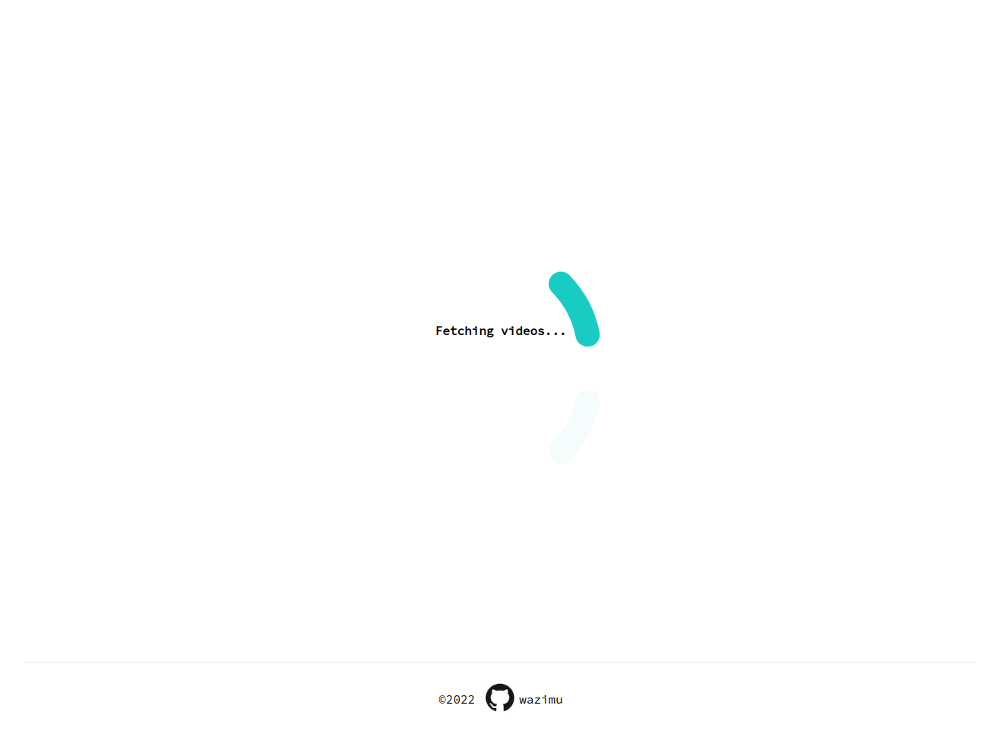
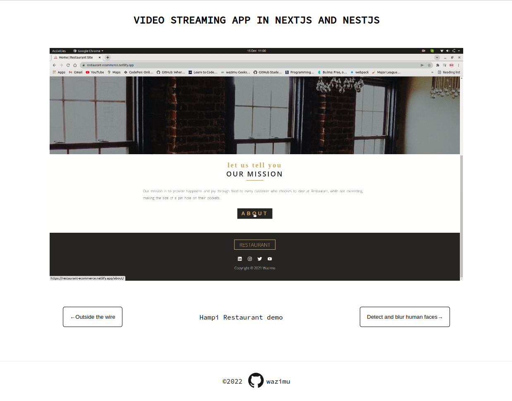

# NextJs Video Streaming

[](https://nextjs-video-streaming.vercel.app/)

[](https://nextjs-video-streaming.vercel.app/)

[](https://nextjs-video-streaming.vercel.app/)

A video streaming app using Node js with Nest js framework for backend and NextJs for Frontend.

Start the NestJs [`Server`](https://github.com/hesbon-osoro/nestjs-video-streaming) the open the frontend.

## Setup

```bash
# Clone the repo
git clone https://github.com/hesbon-osoro/nextjs-video-streaming.git

# Navigate to directory and install packages
cd nextjs-video-streaming && yarn
```

First, run the development server:

```bash
npm run dev
# or
yarn dev
```

Open [http://localhost:3000](http://localhost:3000) with your browser to see the result.

[](https://www.buymeacoffee.com/wazimu)
